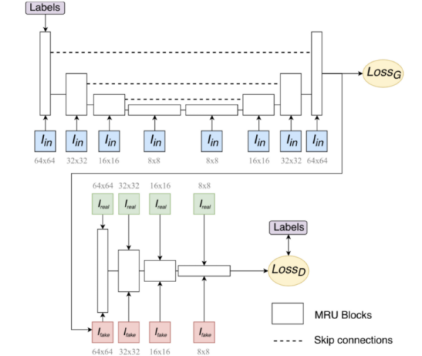
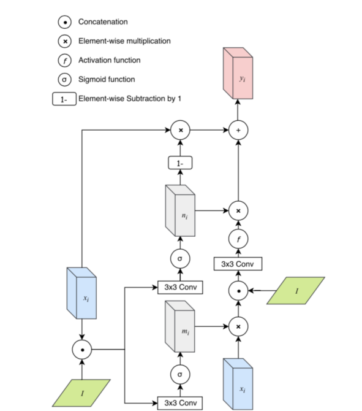

# Image to Image Translation Using SketchyGAN
inzva AI Projects #3 - Image to Image Translation Using SketchyGAN

## Project Description
In this project out goal is to generate image to image translation with GANs. Our primal goal will be generating photo-realistic images from hand drawn sketches. For this purpose we first checked if this problem was already addressed and came across several papers out of which the SketchyGAN paper appealed to us most [1]. We will try and replicate SketchyGAN's results using Keras, making use of several losses and special layers made us of by the paper.

## Dataset
### Dataset preparation
To start off with our problem, we needed paired image to image datasets, preferably edges and photos for our primal goal. We found edges2shoes had quite a bit of paired images and used it to start with [2]. Later on, we realized 20,000 pairs were not enough for the model to perform well. 
We decided to create our own pairs by using a dataset of one class, and chose the CelebA dataset to be a better fit for our model with around 202,000 pairs [3]. We used Holistically Generated Edge Detection to extract the edges of the images in the dataset, and later binarization, erosion and dilation to produce sketch-like edgemaps from the photos [4]. 

### How to prepare
On terminal, run **detect_edges_image.py** to get edges from images.

 - -s for source
 - -d for destination
 - -ts for target size
 - -e for edge detector model (give hed_model to use the pre-trained model)

Run **binarization.py** to get final edge maps.
 - -s for source
 - -d for destination

## Project Dependencies

 - Keras
 - NumPy
 - MatPlotLib
 - TensorFlow
 - Pillow
 - Skicit-Image
 - cv2

## Model
### Baseline Model
The model as seen in the paper by Chen and Hals.  

  

It follows a simple encoder-decoder structure for the generator and encoder structure for the discriminator. We used a one layer discriminator since a multi-layered approach proved rather complex for the problem we are dealing with.
Uses MRU layers instead of convolutional layers, described by the image below:  

  

MRU provides continuous learning on the input image by taking in the input image with different sizes at every layer. 
Skip connections also contribute to the preservation of information by concatenating the output of encoder layers to the decoder inputs at every layer (as seen by the dashed lines in Fig 1.1).

### How to run
After preparing the dataset in a directory, and setting the parameters of the _Dataset_ method in **Super-Mega-Model-128x128.ipynb** to match the root directory of the dataset, make sure the root has 2 folders named _data_ for source images and _edges_final_ for targets. Also change the _save_key_ to match the name of your output directory which should be at the same folder as the notebook.
Run **Super-Mega-Model-128x128.ipynb** and train for the desired number of epochs and iterations. Pass the path to any image you would like to predict to the method _predict_real_ to see your own results.

### Contributors

 - [Burak Bekçi](https://github.com/Bekci) 
 - [Eylül Yalçınkaya](https://github.com/eylulyalcinkaya)  
 - [Cemre Efe Karakaş](https://github.com/cemreefe)

## References

 1. W. Chen and J. Hays. SketchyGAN: Towards Diverse and Realistic Sketch to Image Synthesis. arXiv:1801.02753v2, April 2018.
 2. http://vision.cs.utexas.edu/projects/finegrained/utzap50k/
 3. http://mmlab.ie.cuhk.edu.hk/projects/CelebA.html
 4. https://www.pyimagesearch.com/2019/03/04/holistically-nested-edge-detection-with-opencv-and-deep-learning/
 

> Written with [StackEdit](https://stackedit.io/).

